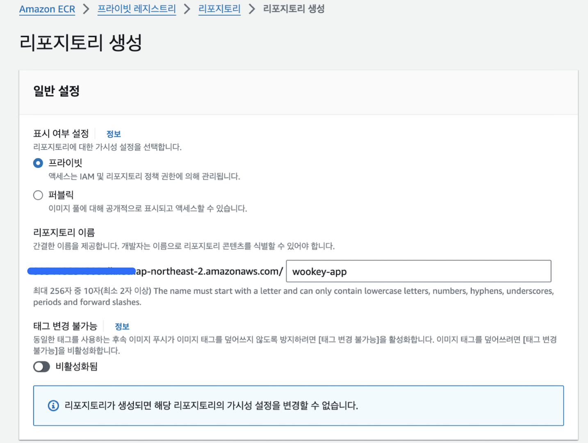
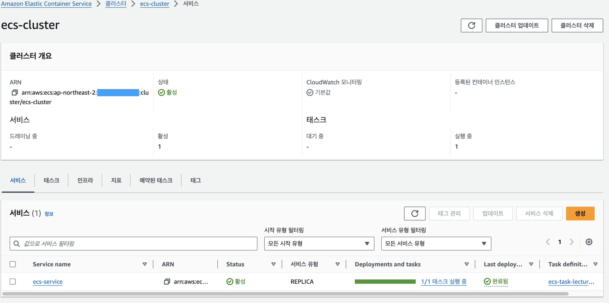
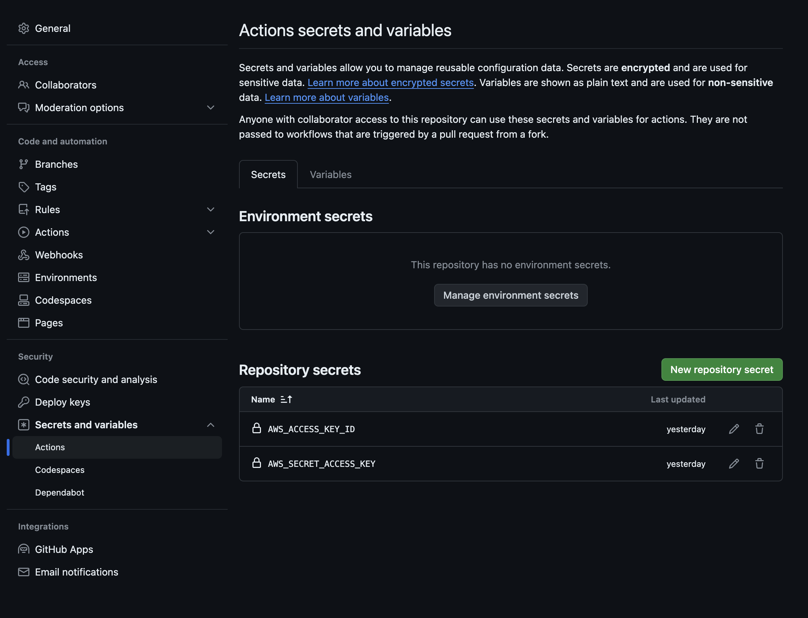

## docker 설치
생략

## Dockerfile 작성
적용할 application에 Dockerfile 생성

## 최신 aws cli 설치
cicd를 구축해놓으면 필요 없지만, cli로 aws에 접속하여 ECR에 이미지를 push 해보려면 필요하다.
* https://docs.aws.amazon.com/ko_kr/cli/latest/userguide/getting-started-install.html

## VPC, subnet 생성
기본 베이스로 private subnet 2개, public subnet 2개로 세팅 하면 된다.

## ECR 생성


## ECR push
Dockerfile이 있는 경로로 이동하여 ECR에 이미지를 build 및 push 진행하면 된다.

만약 push할 때 권한 에러가 발생하면 access key를 발급하여, ~/.aws/config에 profile을 등록하여 ECR에 로그인할 때 profile 옵션을 주고 로그인하여, push를 진행하면 된다.
```sh
vi ~/.aws/config
```
```sh
[profile wookey]
region = ap-northeast-2
aws_access_key_id = [public key]
aws_secret_access_key = [private key]
```


이후 순서대로 진행하여 aws ECR에 docker 이미지를 올린다. 미리 생성해둔 ECR 레포지토리를 선택하면 `푸시 명령보기`가 활성되고, 아래 내용은 해당 모달창에 있는 사항을 그대로 옮긴것이다.
* login
```sh
aws ecr get-login-password --profile [본인이 설정한 profile 명] --region ap-northeast-2 | docker login --username AWS --password-stdin [aws 유저 아이디].dkr.ecr.ap-northeast-2.amazonaws.com
```

* build image
```sh
docker build --platform="linux/amd64" -t [docker image 이름] .
```

* tag
```sh
docker tag [docker image 이름:tag] [aws 유저 아이디].dkr.ecr.ap-northeast-2.amazonaws.com/[docker image 이름:tag]
```

* push
```sh
docker push [aws 유저 아이디].dkr.ecr.ap-northeast-2.amazonaws.com/[docker image 이름:tag]
```

## ECS 클러스터 생성
fargate로 클러스터를 생성해준다. 간단하게 진행하는거면 ec2보다 간단하고 비용적으로도 합리적일 수 있다.

## ECS 태스크 정의
ECR이미지 정보 입력 및 애플리케이션 컨테이너에 사용될 포트(8080)를 매핑한다.

만약 환경변수가 필요하다면 직접 값으로 넣어줘도 되고, ValueForm으로 S3, SSM 등 적절한 도구를 선택해서 arn url 형태로 넣어도 된다.

cpu 및 메모리는 0.5 vCPU, 1 GB로 간단하게 구성했다.

## ECS 서비스 생성
태스크의 서비스를 생성한다. 이 또한 fargate로 생성했다.

네트워크 정보는 public으로 등록하며, 선택적으로 로드밸런서 및 auto 오토스케일링 등록을 할 수 있다.

만약 로드밸런스를 연결한다면 보안 그룹에 80 포트를 열어두도록 한다.

서비스 생성 및 컨테이너가 정상 기동되면 아래와 같이 정상적으로 태스크가 실행중인 모습이 나온다.



## CICD with git action
먼저 AWS연결을 위한 access key를 등록한다.



이후 action을 등록할 git repository에서 Action 탭 이동 후 워크플로우를 등록한다. 

ECS를 검색하면 deploy를 위한 서비스를 지원하며, Configure을 누르면 yml 파일을 하나 커밋하여 레포에 등록하도록 한다.

아래는 간단하게 등록한 파일이니, env 정보만 변경해서 사용하면 된다.

참고로 `ECS_TASK_DEFINITION` 값은 ECS task의 json파일을 다운받고, 이를 애플리케이션의 root(Dockerfile과 동일)에 두면 된다.

```sh
name: Deploy to Amazon ECS

on:
  push:
    branches: [ "master" ]

env:
  AWS_REGION: ap-northeast-2
  ECR_REPOSITORY: [레포지토리 명]
  ECS_SERVICE: [ecs 서비스 명]
  ECS_CLUSTER: [ecs 클러스터 명]
  ECS_TASK_DEFINITION: [task json file 이름(확장자 포함)]
  CONTAINER_NAME: [ecs task 컨테이너 명]

jobs:
  deploy:
    name: Deploy
    runs-on: ubuntu-latest
    environment: production

    steps:
      - name: Checkout
        uses: actions/checkout@v3

      - name: Set up JDK 17
        uses: actions/setup-java@v3
        with:
          java-version: '17'
          distribution: 'adopt'

      - name: Grant execute permission for gradlew
        run: chmod +x gradlew

      - name: build with gradle
        run: ./gradlew clean build -x test

      - name: Configure AWS credentials
        uses: aws-actions/configure-aws-credentials@v1
        with:
          aws-access-key-id: ${{ secrets.AWS_ACCESS_KEY_ID }}
          aws-secret-access-key: ${{ secrets.AWS_SECRET_ACCESS_KEY }}
          aws-region: ${{ env.AWS_REGION }}

      - name: Login to Amazon ECR
        id: login-ecr
        uses: aws-actions/amazon-ecr-login@v1

      - name: Build, tag, and push image to Amazon ECR
        id: build-image
        env:
          ECR_REGISTRY: ${{ steps.login-ecr.outputs.registry }}
          IMAGE_TAG: ${{ github.sha }}
        run: |
          docker build -t $ECR_REGISTRY/$ECR_REPOSITORY:$IMAGE_TAG .
          docker push $ECR_REGISTRY/$ECR_REPOSITORY:$IMAGE_TAG
          echo "image=$ECR_REGISTRY/$ECR_REPOSITORY:$IMAGE_TAG" >> $GITHUB_OUTPUT

      - name: Fill in the new image ID in the Amazon ECS task definition
        id: task-def
        uses: aws-actions/amazon-ecs-render-task-definition@v1
        with:
          task-definition: ${{ env.ECS_TASK_DEFINITION }}
          container-name: ${{ env.CONTAINER_NAME }}
          image: ${{ steps.build-image.outputs.image }}

      - name: Deploy Amazon ECS task definition
        uses: aws-actions/amazon-ecs-deploy-task-definition@v1
        with:
          task-definition: ${{ steps.task-def.outputs.task-definition }}
          service: ${{ env.ECS_SERVICE }}
          cluster: ${{ env.ECS_CLUSTER }}
          wait-for-service-stability: true
```

정상적으로 ECS에 CI/CD가 적용된 모습이다.


###
***
####
* <https://ksh-coding.tistory.com/134##2-2.%20Task%20%26%20Task%20Definition-1>
* <https://kobumddaring.tistory.com/76>
* <https://velog.io/@ekxk1234/ECS-%EC%B2%B4%ED%97%98%EA%B8%B0>
