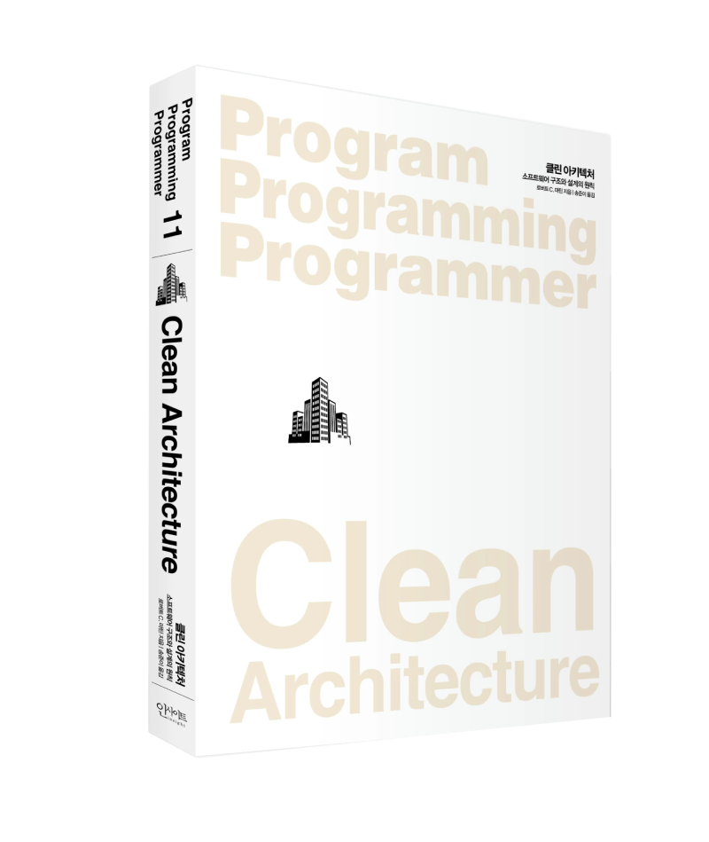

## 소프트웨어 시스템
소프트웨어(soft ware)는 부드러운(soft)와 제품(ware)의 합성어이다. 즉 소프트웨어를 만드는 이유는 기계의 행위를 쉽게 변경할 수 있도록 하기 위해서다. 그게 아니라면 하드웨어라 불렀을 것이다. 소프트웨어는 반드시 부드러워야 하며, 이는 곧 변경하기 쉬어야 한다는 것을 뜻한다. 새로운 기능이나 변경이 쉬운 소프트웨어를 개발하기 위해 시스템 아키텍처는 독립적이어야 한다.

## 구조, 객체, 함수형 프로그래밍
* 구조적 프로그래밍은 제어흐름의 직접적인 전환에 부과되는 규율
* 객체 지향 프로그래밍은 제어흐름의 간접적인 전환에 부과되는 규율
* 함수형 프로그래밍은 변수 할당에 부과되는 규율

각 패러다임은 우리가 코드를 작성하는 방식의 형태를 한정 시킬뿐 변한게 없다. 또한 1946년 엘런 튜링이 최초의 코드를 작성할 때 사용한 소프트웨어 규칙과 지금의 규칙은 조금도 다르지 않다.
즉 도구와 하드웨어는 변했지만 소프트웨어는 그대로이다. 그대로 소프트웨어는 순차(sequence), 분기(selection), 반복(iteration), 참조(indirection)으로 구성될 뿐 그 이상 그 이하도 아니다.

## SOLID
* SRP는 하나의 일만 해야한다는 의미로 잘못 알고 있는 경우가 많다. 단일 모듈은 변경의 이유가 오직 하나 뿐이어야 한다는 뜻이다. 즉, 단일 모듈은 오직 하나의 사용자 또는 이해관계자에 대해서만 책임져야 한다.
* OCP의 목표는 시스템을 확장하기 쉬운 동시에 변경으로 인해 시스템이 너무 많은 영향을 받지 않도록 하는데 있다. 이러한 목표를 달성하려면 시스템 컴포넌트 단위를 분리하고, 저수준 컴포넌트에서 발생한 변경으로부터 고수준 컴포넌트를 보호할 수 있는 형태의 의존성 계층구조가 만들어지도록 해야한다.
* LSP는 아키텍처 수준까지 확장할 수 있고, 반드시 확장해야한다. 치환 가능성을 조금이라도 위배하면 시스템 아키텍처가 오염되어 상당량의 별도 메커니즘을 추가해야 할 수 있기 때문이다.
* ISP는 불필요한 인터페이스 상속 관계에 의해 잠재되는 문제 상황들이 생길 수 있다. 불필요한 짐을 실은 무언가에 의존하면 예상치 못한 문제에 빠질 수 있다는 것이다.
* DIP는에서 말하는 '유연성이 극대화된 시스템'이란 소스 코드 의존성이 추상(abstract)에 의해 의존하며 구체에는 의존하지 않는 시스템이다. 이를 위해서는 안정된 추상화를 지향해야하며, 변동성이 큰 구체 클래스를 참조, 파생하지 말아야 한다.

## 아키텍처
### 경계선 긋기
소프트웨어 아키텍처에서 경계선을 그리려면 먼저 시스템을 컴포넌트 단위로 분할해야 한다. 일부 컴포넌트는 핵심 업무 규칙에 해당하며, 나머지는 플러인으로 핵심 업무와는 직접적인 관련이 없지만 필수 기능을 포함한다. 그런 다음 컴포넌트 사이의 화살표가 특정 방향, 즉 핵심 업무를 향하도록 이들 컴포넌트의 소스를 배치한다. 이는 의존성 역전 원칙과 안정된 추상화 원칙을 응용한 것이다. 의존성 화살표는 저수준 세부사항에서 고수준의 추상화를 향하도록 배치된다.

### 소리치는 아키텍처
좋은 아키텍처는 유스케이스를 그 중심에 두기 때문에 프레임워크나 도구, 환경에 전혀 구애받지 않고 유스케이스를 지원하는 구조를 아무런 문제 없이 기술할 수 있다. 좋은 아키텍처는 유스케이스에 중점을 두며, 관심사에 대한 결합은 분리시킨다. 아키텍처는 시스템을 이야기해야하며, 시스템에 적용한 프레임워크에 대해 이야기해서는 안된다. 당신이 헬스 케어 시스템을 구축하고 있다면 새로 들어온 개발자는 소스를 보고 "오 헬스 케어 시스템이군!" 해야만 한다.

## 클린 아키텍처

클린 아키텍처에서 소스코드의 의존성은 반드시 안쪽으로, 고수준의 정책을 향해야한다. 우리는 외부 원에 위치한 어떤 것도 내부의 원에 영향을 주지 않도록 설계해야 한다.
### 엔티티
엔티티는 전사적인 핵임 업무 규칙을 캡슐화하며, 외부의 무언가가 변경되더라도 엔티티가 변경될 가능성은 지극히 낮아야 한다. 즉, 가장 고수준인 규칙을 캡슐화 하는 것이다. 운영 관점에서 특정 애플리케이션이 무언가 변경이 필요하더라도 엔티티 계층에는 절대로 영향을 주어서는 안된다.

### 유스케이스
유스케이스 계층의 소프트웨어는 애플리케이션에 특화된 업무 규칙을 포함한다. 또한 유스케이스 계층의 소프트웨어는 시스템의 모든 유스케이스를 캡슐화하고 구현한다. 유스케이스는 엔티티로 들어오고 나가는 데이터 흐름을 조정하며, 엔티티가 자신의 핵심 업무 규칙을 사용해서 유스케이스의 목적을 달성하도록 이끈다. 하지만 이 계층에서 발생한 변경이 엔티티에 절대 영향을 줘서는 안된다. 운영 관점의 변경은 유스케이스가 영향 받으며, 이 계층의 소프트웨어에도 경향을 줄 것이다.

### 인터페이스 어댑터
인터페이스 어댑터 계층은 일련의 어댑터들로 구성된다. 어댑터는 데이터를 유스케이스와 엔티티에게 가장 편리한 형식에서 데이터베이스나 웹 같은 외부 에이전시에게 가장 편리한 형식으로 변환한다. 또한 이 계층에는 데이터를 외부 서비스와 같은 외부적인 형식에서 유스케이스나 엔티티에서 사용되는 내부적인 형식으로 변환하는 또 다른 어댑터가 필요할 수 있다.

## 한줄 리뷰
> 유연하고 변경에 강한 소프트웨어를 개발하기 위해, 클린 아키텍처는 고수준의 도메인 중심에서 경계를 명확히 할 수 있는 방법을 가이드 한다.

