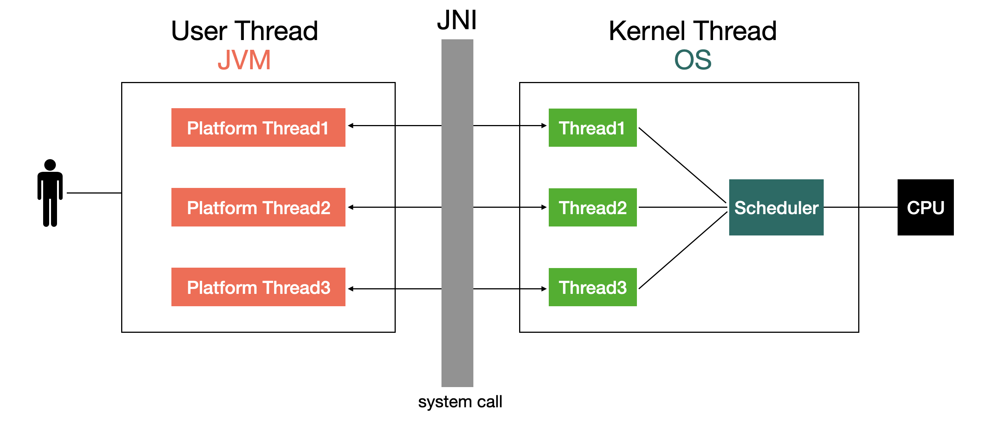
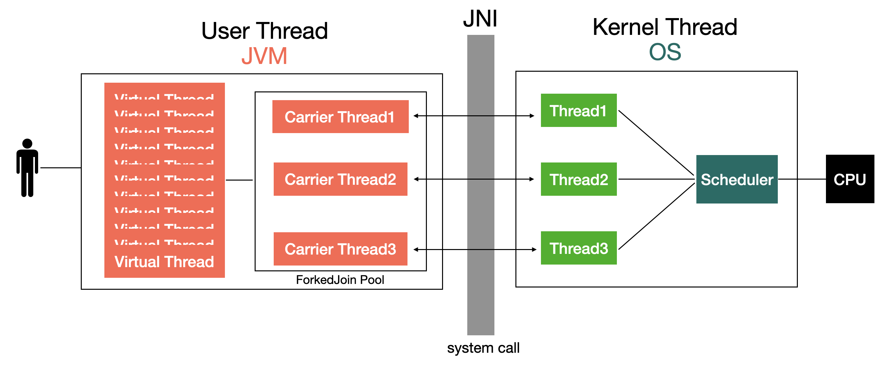
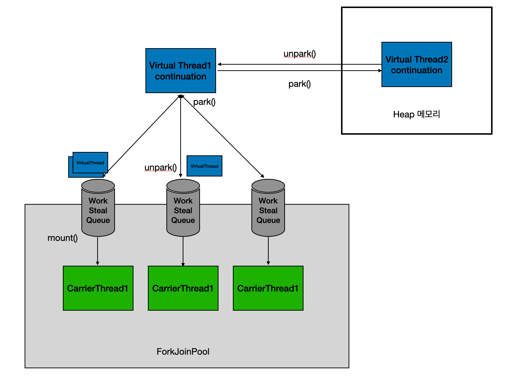
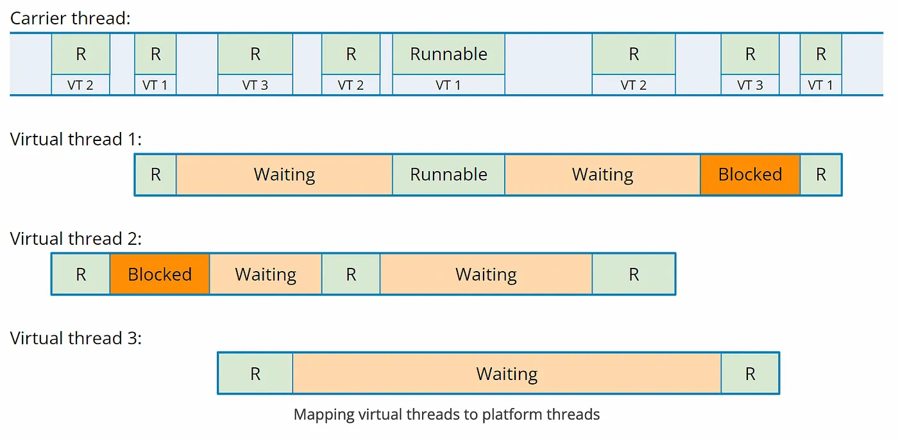

## virtual thread 탄생 배경
전통적인 java thread는 작업 task에 따라 리소스를 할당하여 사용할 수 있도록 제공되어, 긴 세월 java application의 핵심 요소 자리잡고 있다. 이는 운영 체제의 thread에 직접 매핑된며, 새 thread를 생성하려면 JNI를 통한 system call 과정이 필요하여, 시스템에 따라 제한된 수의 thread만 지원할 수 있다. 결과적으로 개발자는 동시성을 관리하기 위해 여러 프레임워크나 라이브러리, webflux와 같은 시스템에 의존해야 했다. 이를 해결 하기 위해 JDK19부터 Project Loom 이라는 주제로 java의 경량 thread 모델에 대한 개발이 진행 되었으며, JDK21에 virtual thread가 정식 릴리즈 되었다.

## 기존 thread

java의 thread는 native thread 모델로, 유저 thread를 만들게되면 Java Native Interface(JNI)를 통해 thread를 할당 받고 이를 JVM의 platform thread에 매핑한다. 이때 thread를 할당 받기 위해서는 OS로 부터 system call 과정이 필요하고, 이는 많은 비용을 발생 시킨다. 그리고 thread의 I/O, sleep, interrupt 등의 상황은 thread를 blocking/wait 시키게 되며, 그 사이에 다른 thread가 커널 thread를 점유하여 작업을 수행하게 된다. 이 과정을 `context switching`라고 한다. 


기존 thread 모델은 프로세스를 만들어 사용하는것에 비해 저렴한 비용과 context swiching 비용으로 요청량이 많은 서비스에 다양하게 활용되고 있다. 하지만 매우 트래픽이 많은 대규모의 서비스는 thread의 요청에 한계가 있고, 서버 증설 등 물리적 자원에 의존하고 있다. 서버 메모리가 4GB이면 1MB thread 요청도 한번에 최대 4천개를 처리하는게 한계이기 때문이다. 물론 실제로는 다른 자원의 요청을 생각하면 이보다 더 낮게 처리해할 것이다. 따라서 요청 처리량, context switching등에 사용되는 비용을 줄일 필요성이 지속적으로 제기되었고, 이를 위해 도입된 기술이 virtual thread이다.

## virtual thread


virtual thread에서는 forkjoin poll에 의해서 기존 platform thread들이 carrier thread로 관리된다. 마치 JVM이 직접 관리하는 thread poll이라고 생각해도 된다. JVM heap내에서 직접 thread의 추가/삭제 등 관리에 대한 자원을 관리하며, N개의 virtual thread 매핑되어 context swiching 비용이 매우 저렴하다. 

|비교|Thread|Virtual Thread|
|------|---|---|
|memory 사용|미리 할당된 stack|필요 할 때 heap|
|stack 크기|~2MB|~10KB|
|생성 시간|~1ms|~1µs|
|context swiching 비용|~100µs|~10µs, ns|

기존 java의 thread는 기본적으로 최대 2MB의 스택 메모리 사이즈를 가지기 때문에, context swiching 시 메모리 이동량이 크다. 그리고 thread의 생성을 위해 OS커널과 통신하여 스케줄링해야 하므로, system call을 이용한 생성 비용도 적지 않다. 하지만 virtual thread는 carrier thread 생성을 제외하면 JVM에 의해 생성되기 때문에 thread의 생성 시간이나 context swiching 비용이 매우 적다.

### 동작원리
```java
VirtualThread(Executor scheduler, String name, int characteristics, Runnable task) {
    super(name, characteristics, /*bound*/ false);
    Objects.requireNonNull(task);

    // choose scheduler if not specified
    if (scheduler == null) {
        Thread parent = Thread.currentThread();
        if (parent instanceof VirtualThread vparent) {
            scheduler = vparent.scheduler;
        } else {
            scheduler = DEFAULT_SCHEDULER;
        }
    }

    this.scheduler = scheduler;
    this.cont = new VThreadContinuation(this, task);
    this.runContinuation = this::runContinuation;
}
```
```java
private static ForkJoinPool createDefaultScheduler() {
    ForkJoinWorkerThreadFactory factory = pool -> {
        PrivilegedAction<ForkJoinWorkerThread> pa = () -> new CarrierThread(pool);
        return AccessController.doPrivileged(pa);
    };
    ...
}
```

virtual thread를 생성할 때 특정 스케줄러에 대한 정보를 따로 주지 않으면 DEFAULT_SCHEDULER에 의해서 스케줄 되며, 이때 만들어지는 스케줄러는 carrier thread를 forkjoin poll로 관리하도록 만들어진다.



이때 각각의 carrier thread에는 work queue가 있으며, 각각의 queue에 있는 runContinuation들은 forkjoin poll에 의해 work stealing 방식으로 동작한다. 즉, runContinuation들의 동작에 sleep, interrupt 등의 작업이 있으면 park(), unpark() 과정의 반복으로 작업 된다. 이는 실제 thread가 멈추는게 아닌, 각 virtual thread가 yeild 된다. 따라서 더 이상의 blocking 연산은 실행중인 thread를 차단하지 않으며, 더 많고 작은 virtual thread의 요청으로 carrier thread에 의해 병렬적으로 처리 될 수 있다.

```java
public static void park(Object blocker) {
    Thread t = Thread.currentThread();
    setBlocker(t, blocker);
    try {
        if (t.isVirtual()) {
            VirtualThreads.park();
        } else {
            U.park(false, 0L);
        }
    } finally {
        setBlocker(t, null);
    }
}
```
```java
public static void unpark(Thread thread) {
    if (thread != null) {
        if (thread.isVirtual()) {
            VirtualThreads.unpark(thread);
        } else {
            U.unpark(thread);
        }
    }
}
```
park(), unpark() 메소드를 보면 JDK21부터 isVirtual() 분기를 통해 제공된다. 기존의 U.park(), U.unpark()가 LockSupport.java에서 native method로 system call에 의해 제공 사항은 제거함으로써 빠르게 context swiching이 가능하게 되었다.


그래서 thread에 blocking 연산이 들어와도 각 virtual thread의 작업 스케줄링이 forkjoin poll 내 carrier thread에서 관리되기 때문에 적은 context swiching 시간을 통한 높은 처리량을 가질 수 있다.

## 성능 테스트
### 환경
* OS: macOS Ventura 13.6.3
* CPU: M2
* Memory: 32GB
* Version: JDK21 / Springboot 3.2.x

좋은 컴퓨터만 가진 클라우드 흙수저라, 로컬에서 진행했다.

### springboot
```yml
spring:
  threads:
    virtual:
      enabled: true
```
springboot 3.2.x 이상 버전에서 virtual thread를 적용하는 방법은 진짜 심플하다. 개발팀에서 호환성에 신경써놓은 덕분에 정말 편하게 적용한다. property file에 thread enable을 true 하면 thread가 virtual로 동작한다. 이하 버전에서는 @Bean으로 등록해서 사용해야한다.

```kotlin
@RestController
class CodeController {
    @GetMapping("/io-bound")
    fun ioBound() {
        Thread.sleep(500) // db hard select
        Thread.sleep(100) // get hard api call
        Thread.sleep(300) // post hard api call
    }

    @GetMapping("/cpu-bound")
    fun cpuBound(): Long {
        return (0 .. 100_000_000).sum().toLong()
    }
}
```
간단하게 I/O, CPU bound 테스트를 진행해볼 예정이다. I/O 테스트는 post API를 진행할 때 DB, API call 등의 무거운 작업들로 I/O 시간이 꽤 걸리는 API라고 가정한다. 그리고 CPU 테스트는 단순 계산을 반복 수행하도록 했다. 이는 실제 상황에서는 결과가 절대적으로 다를 것이니, 테스트로만 봐주면 좋을것 같다. 모든 테스트는 reqeust user thread를 점진적으로 올리면서 테스트 했으며, ramp-up 시간은 3s로 고정했다.

|I/O bound Test  | User  | Throughput | Time |
|----------------|------|------------|------|
| Thread         | 300  | 77/s         | 3s    |
| Thread         | 1500  | 200/s        | 7s    |
| Thread         | 3000 | 118.3/s      | 25s   |
| Virtual Thread | 300  | 77/s         | 3s    |
| Virtual Thread | 1500  | 384.3/s      | 3s    |
| Virtual Thread | 3000 | 728/s        | 3s    |
| Virtual Thread | 6000 | 865.8/s      | 6s    |


|CPU bound Test  | User  | Throughput | Time |
|----------------|------|------------|------|
| Thread         | 30  |7.1/s          |4s     |
| Thread         | 150  |7.8/s         |19s     |
| Thread         | 600 |7.6/s       |79s    |
| Virtual Thread | 30  | 7.2/s         | 4s    |
| Virtual Thread | 150  | 8.2/s      | 18s    |
| Virtual Thread | 600 | 7.5/s        | 78s    |


* I/O bound 
    * thread와 virtual thread 둘다 tomcat thread poll이 처리 가능한 범위 내에선 같은 성능을 보인다.
    * thread는 spring boot 기본 tomcat thread poll size(200)에 의해 최대 처리량 이상의 요청이 오자 급격하게 처리량이 떨어짐과 동시에 처리 속도가 떨어졌다.
    * virtual thread는 경우 3000 user(1000tps)를 가볍게 수행했으며, 이후 추가로 6000 user 테스트 진행 후, 처리량이 늘긴 했으나 이전 테스트와 비교하여 비례적으로 처리량이 올라가진 않았고 처리시간도 조금 밀렸다. 아마 처리량은 수행하는 로직이나 환경에따라 다를 것이다.
* CPU bound
    * CPU Bound 작업에서는 일반 thread랑 거의 차이가 없거나, 오히려 일반 thread가 성능상 우위를 보이기도한다.
    * 경량 스레드가 결국 platform 스레드 위에서 동작하기 때문에, thread 생성 비용에 virtual thread 생성 및 스케줄링 비용까지 포함되어 성능 낭비가 발생한다.
    * I/O Bound 작업과 같이 context switching이 빈번하지 않는 경우에는 크게 이점이 없다.

### vs kotlin coroutines
```kotlin
@RestController
class CodeController {
    @GetMapping("/io-bound")
    fun ioBound() {
        Thread.sleep(500) // db select
        Thread.sleep(100) // get api call
        Thread.sleep(300) // post api call
    }

    @GetMapping("/io-bound-coroutine")
    suspend fun ioBoundCoroutine() {
        CoroutineScope(Dispatchers.IO).async {
            delay(500) // db select
            delay(100) // get api call
            delay(300) // post api call
        }.await()
    }
}
```

|I/O bound Test  | User  | Throughput(/s) | Time(s) |
|----------------|------|------------|------|
| Virtual Thread | 300  | 77         | 3    |
| Virtual Thread | 1500  | 384.3      | 3    |
| Virtual Thread | 3000 | 728        | 3    |
| Virtual Thread | 6000 | 865.8      | 6    |
| Coroutines     | 300  | 76.9       | 3    |
| Coroutines     | 1500  | 384.3      | 3    |
| Coroutines     | 3000 | 768.2      | 3   |
| Coroutines     | 6000 | 869.2      | 7   |

kotlin coroutine과 비교하여 비슷한 동작으로 테스트를 진행했다. I/O 테스트만 진행했고, 결과는 비슷했다. 아주 미세한 차이로 coroutine의 처리량이 좋아보이는것 같다. 사실 둘 다 Continuation을 구현한 구현체라 거의 비슷한 성능을 보이는것 같다. kotlin에서는 yeild 대신 suspend 라는 중단 지점을 컴파일 시점에서 알 수 있으니, 좀 더 최적화 되어 있지 않을까 생각이 든다.

기존 java 사용자라면 대량 트래픽의 gateway 로써 또는 I/O 작업에 대해 vitual thread를 도입하는게 성능 개선에 큰 영향을 줄 수 있을것 같다. 그리고 가장 큰 장점은 기존 java thread 로직과 일부만 수정하면 거의 대부분 호환 가능하여, 빠르게 고가용성의 서버로 전환할 수 있을것 같다. 그리고 kotlin 유저는 여전히 coroutine을 사용해도 좋을 것 같다. 성능 성능도 좋을 뿐더러, 자식/부모 scope와 같이 구조화된 coroutine을 사용할 수도 있고, 특정 scope 실행을 취소 시켜버리거나 에러를 핸들링하기 쉽다는 장점도 존재하기 때문이다.

## virtual thread 사용 주의 사항
* CPU bound를 위해서 사용하면 안된다. I/O 작업 없이 CPU 작업만 수행하는 경우 기존 platform thread 보다 성능이 떨어진다.
* Thread Local을 사용을 피해야한다. 이는 여러 thread가 있을때 각 thread만을 위한 저장 공간이라 생각하면 되며, virtual thread가 무수히 많이 엄청 작은 단위로 생성되기 때문에 자칫하면 메모리 누수, 에러를 야기할 수 있다.
* Pinned issue가 발생될 요소를 피해야한다. virtual thread 내에서 synchronized, parallelStream, 혹은 native method를 사용하면 virtual thread가 carrier thread에 고정되는 문제가 있다. 이런 경우, virtual thread의 장점인 non-blocking의 경량 thread 방식으로 동작하지 않는다. synchronized 대신 ReentrantLock을 사용하는 것이 좋다.

## 결론
virtual thread는 기존 java thread에 매우 높은 호환성을 갖고 높은 처리량을 가진 구조라 생각한다. kotlin의 coroutine도 안정화 기간이 있었던 만큼, virtual thread도 더욱 안정화되어 실무에서 곧 만날 날이 멀지 않을것 같다.

##
***
###
* https://techblog.woowahan.com/15398/
* https://nangmandeveloper.tistory.com/6
* https://perfectacle.github.io/2022/12/29/look-over-java-virtual-threads/